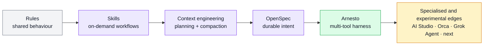
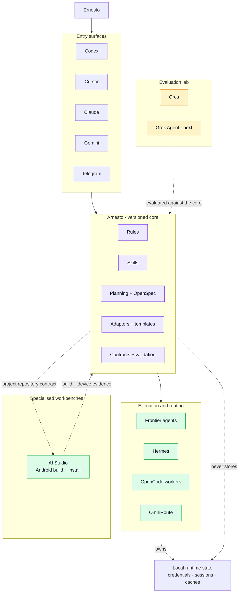

<h1 align="center">Arnesto</h1>

<p align="center">
  <strong>The agent harness that got out of hand.</strong><br>
  Personal by design, public as a reference, and never quite finished.
</p>

<p align="center">
  <a href="https://github.com/saski/arnesto/actions/workflows/check.yml"></a>
  <a href="https://github.com/saski/arnesto/blob/main/LICENSE"></a>
  
</p>

Arnesto is the versioned operating layer behind my AI-assisted work. It brings
together rules, skills, planning, specifications, tool adapters, and local
wiring so that different coding agents can share one coherent way of working.

It is not a universal agent framework or a polished distribution. It is a
working system shaped around my environment, published so other people can
inspect it, borrow from it, and adapt the useful pieces to their own stack.

## Why “Arnesto”?

**Arnesto** is a small collision between the Spanish word *arnés* —harness—
and Ernesto. The name fits what the repository became: no longer a collection
of configuration files, but the harness connecting an increasingly unruly set
of tools.

## How it got here

The repository started in Q3 2025 as a fork of a coding-agent configuration.
Each generation of tools changed what the repository needed to hold:



That evolution is the point. Arnesto preserves the stable lessons while
letting models, clients, and orchestration experiments change around them.

## The shape of the harness



The repository owns portable intent and repeatable behaviour. Each tool keeps
its credentials, sessions, databases, trust state, and mutable preferences in
its own runtime.

AI Studio is a specialised workbench rather than another control plane. The
Health tracking project validated a narrow workflow in which Codex and OpenSpec
owned requirements, source changes, tests, and review in a canonical GitHub
repository, while AI Studio synchronised that repository, built the Android
app, and installed it on the phone. This preserved an auditable source of truth
without requiring a local Android Studio, SDK, or ADB setup.

## What is stable, and what moves

| Stable core | Specialised and experimental edge |
|---|---|
| Compact rules loaded progressively | Model and provider availability |
| Skills selected only when relevant | Routing combinations |
| OpenSpec for durable requirements and decisions | New entry surfaces and agent clients |
| Canonical repositories and review boundaries | AI Studio as an Android build and install workbench |
| Explicit runtime and credential boundaries | Orca evaluation |
| Behaviour-level contracts and `make check` | Grok Agent as the next exploration |

An experiment is not promoted because it looks interesting. It must solve a
real problem, respect the existing boundaries, and survive a useful task with
observable evidence.

## What is in the repository

| Path | Role |
|---|---|
| `.agents/rules/` | Compact universal, repository, and contextual instructions |
| `.agents/skills/` | Reusable workflows loaded on demand |
| `.agents/commands/` | Command-shaped entry points for compatible clients |
| `.agents/mcp.json` | Shared, secret-free MCP definitions |
| `docs/openspec/` | Active and archived specifications |
| `templates/` | Portable defaults for mutable local configuration |
| `thoughts/` | Research and implementation plans kept out of chat context |
| `setup-symlinks.sh` | Local wiring and validation |
| `Makefile` | Canonical checks |

The full skill inventory deliberately stays out of this README. Discovery
belongs to the active client and the domain routing catalog, not to a giant
prompt loaded on every task.

## Explore or adapt it

Start by reading the repository before installing anything. The setup script
creates links under your home directory and seeds selected local templates.

```bash
git clone https://github.com/saski/arnesto.git
cd arnesto
make ci-check
```

If the conventions fit your environment, install the managed links and run the
complete local validation:

```bash
./setup-symlinks.sh setup
make check
```

My local SSH remote uses the `saski` host alias:

```text
git@github.com-saski:saski/arnesto.git
```

The setup recreates local shims such as `~/.agents/bin/openspec`; mutable
runtime state remains outside the repository. Forking and removing the pieces
that do not match your tools is an expected way to use Arnesto.

## Where to go next

- [Architecture snapshot](docs/local-agentic-development-architecture.md) —
  stable core, operational integrations, and evaluation boundaries.
- [Development guide](docs/development-guide.md) — repository structure,
  skill governance, setup, and validation.
- [Hermes, OmniRoute, and Telegram operations](docs/hermes-omniroute-operations.md)
  — the current remote-entry runbook.
- [Runtime boundaries](docs/codex-orca-runtime-boundary.md) — why Codex, Orca,
  Hermes, and OmniRoute keep separate mutable state.
- [Project status](PROJECT_STATUS.md) — what is stable, under evaluation, and
  deliberately deferred now.

## Design principles

1. Keep universal instructions small.
2. Load specialised knowledge only when the task needs it.
3. Preserve intent and decisions outside transient chat context.
4. Prefer explicit routing and visible failure over magical fallback.
5. Keep credentials and mutable runtime state with the tool that owns them.
6. Promote experiments only after they earn a place in the stable core.

## Provenance

Arnesto grew from
[Eduardo Ferro's augmented-code configuration](https://github.com/eferro/augmentedcode-configuration).
The complete Git history preserves that origin. The former fork remains
archived as a public migration and provenance record.

## License

[Unlicense](LICENSE) — public domain.
