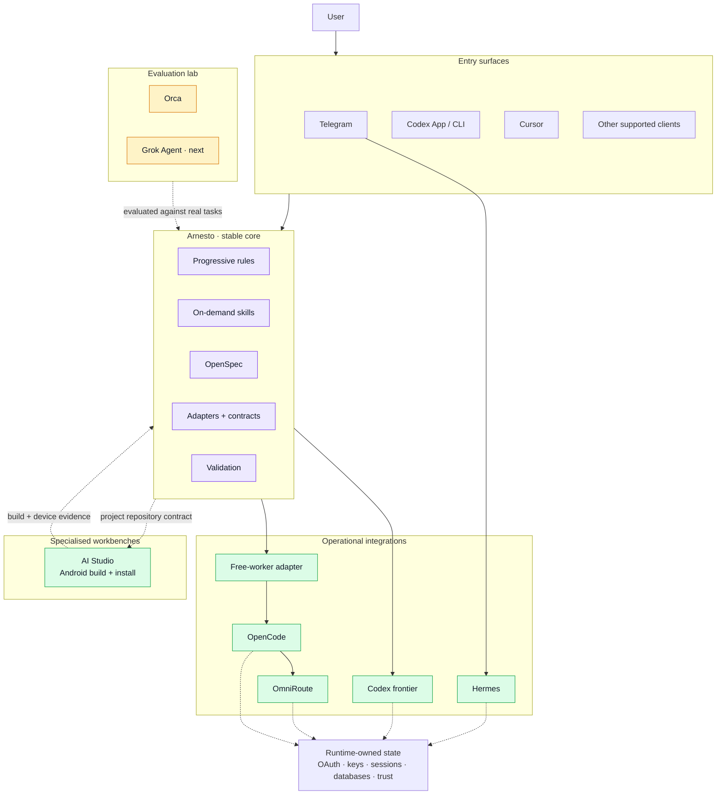
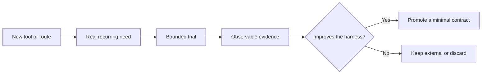

# Agentic Development Architecture

**Current state verified:** 2026-08-19
**Adoption posture:** operational core with evidence-gated experimental edges

Arnesto is a personal agent harness in constant evolution. This document is a
snapshot of the stable boundaries and the integrations currently being tested;
it is not a promise that every named tool will become part of the core.

## Architectural stance

- Codex frontier agents own ambiguous planning, implementation, integration,
  and final review.
- OpenSpec preserves requirements, decisions, tasks, and acceptance evidence.
- Bounded, non-sensitive work may use OpenCode through an explicit worker
  contract and a semantically verified free route.
- Hermes provides persistent remote entry without owning the Codex runtime.
- OmniRoute is a provider gateway, not the control plane.
- AI Studio is a specialised Android generation, build, and device-install
  workbench; the GitHub repository remains canonical.
- Orca is under evaluation as a workspace and supervision surface.
- Grok Agent is the next planned evaluation; no integration assumptions have
  been accepted yet.
- Credentials and mutable runtime state stay with the runtime that owns them.

## Current topology

## Stable boundaries

| Boundary | Contract |
|---|---|
| Arnesto repository | Owns portable instructions, skills, specifications, templates, and validation |
| Codex | Owns its OAuth session, local configuration, hooks, and execution state |
| Hermes | Owns gateway configuration, messaging state, profiles, and credentials |
| OpenCode | Executes only the worker contract explicitly given to it |
| OmniRoute | Provides model access but does not choose task intent or paid fallback |
| AI Studio | Generates, builds, and installs a synchronised Android project; the repository, requirements, privacy contract, and review remain external and canonical |
| Orca | Keeps an isolated Codex runtime while its value is evaluated |
| Future clients | Start outside the critical path and inherit no credentials implicitly |

Closing Orca must not interrupt Hermes, Telegram, Codex, OpenCode, or
OmniRoute. Likewise, changing a Codex default must not silently change Hermes
or OmniRoute routing. See
[Codex, Orca, Hermes, and OmniRoute runtime boundaries](codex-orca-runtime-boundary.md).

## Experimental promotion loop

Promotion requires more than a successful demo. A candidate must:

1. solve a recurring problem rather than duplicate an existing surface;
2. preserve runtime, credential, and privacy boundaries;
3. remain observable and recoverable during a real task;
4. avoid adding another hidden routing decision; and
5. justify its permanent context and maintenance cost.

## Specialised and experimental edges

### AI Studio

The Health tracking project validated AI Studio beyond an initial prototype.
It accelerated the Kotlin and Jetpack Compose application, then remained useful
as a GitHub-synchronised build and installation surface while Codex and
OpenSpec owned the requirements, implementation changes, tests, privacy
decisions, and final review in the canonical repositories.

The hosted workbench used synthetic data for development. Real health data
stayed on the phone and moved only through the explicitly authorised Android
export flow. AI Studio does not become a source of truth, an orchestration
owner, or a place to store runtime credentials merely because this workflow
succeeded.

### Orca

Orca is being tested as an optional visual workspace for repositories,
terminals, worktrees, and agent supervision. It stays at the edge until several
real tasks show that it materially improves concurrency, observability, or
recovery.

There is no Hermes-to-Orca bridge, automatic task creation, or Orca-owned
routing decision. Its Codex runtime remains intentionally separate.

### Grok Agent

Grok Agent is queued as the next evaluation. The trial will begin by asking
which existing pain it could remove, then test the smallest reversible
integration. Provider assumptions, credential sharing, and permanent routing
changes are explicitly out of scope until evidence supports them.

## What this architecture avoids

- one universal router making opaque decisions for every client;
- credentials copied between runtimes for convenience;
- model names embedded in permanent architecture;
- synchronous remote requests waiting on long-running background work;
- adopting a tool because it is new rather than because it improves the
  system; and
- diagrams that present a desired future as an implemented fact.
