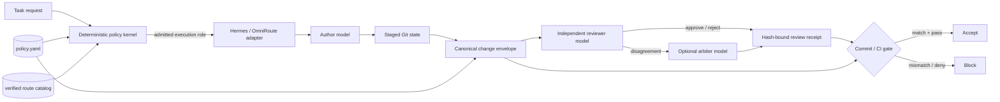

# Karajan Policy and Hashing Assessment for Arnesto

**Date:** 2026-09-22  
**Scope:** Deterministic policy enforcement, multi-model control roles, and change-bound approvals  
**Decision status:** Proposed architecture; no runtime or repository governance changes applied

## Executive summary

Arnesto should adopt the core governance ideas, not Karajan as its new harness.
The narrow capability Arnesto needs is materially smaller than Karajan's full
product surface:

1. a deterministic policy kernel that decides which observable actions, roles,
   routes, and models are admissible;
2. blocking adapters at tool-use, commit, and CI boundaries;
3. review attestations bound to the exact staged change and policy version; and
4. an optional independent arbiter when two model roles disagree.

OmniRoute and Hermes are useful execution surfaces for this design. They should
not become the authorization authority. The policy kernel selects an admissible
route from a closed, repository-owned catalog; Hermes or OmniRoute then executes
that route. This preserves Arnesto's current boundary that OmniRoute is a model
gateway and Hermes is an entry/runtime surface.

A hash alone only detects that inputs changed. It does not prove who reviewed or
approved them. Arnesto should first use hashes as stale-approval invalidators,
then add detached signatures only if the threat model requires authenticated
approval against an agent with local shell access.

## Evidence and current state

### Arnesto

- `make check` is the full local validation suite and `make ci-check` is the
  portable CI subset.
- The tracked `hooks/pre-commit` runs `make check`, but this checkout currently
  has no installed `pre-commit` hook and no configured `core.hooksPath`.
- GitHub Actions runs the `check` workflow, but `main` is currently unprotected,
  so the check is evidence rather than a required merge gate.
- The current Codex hook rewrites Bash calls through RTK. It is not a project
  policy blocker.
- Arnesto already has a small policy-as-data precedent:
  `.agents/free-agent-routing.json` admits verified free models and bounded task
  classes, while `run-free-worker` enforces model, sensitivity, timeout,
  worktree ownership, changed-file scope, and validation constraints.
- Provenance locks contain SHA-256 values for imported skills, but these hashes
  establish source integrity rather than approval of a working-tree change.
- Codex 0.149.1 in this environment reports stable hook support. Current Codex
  hook documentation supports a blocking `PreToolUse` decision, so Arnesto can
  enforce preventive project policy for Codex without waiting for a new client
  capability.

### Karajan 4.31.1

The public Karajan repository was inspected at commit
`2a219fdde2566158d1024a13b6dd036e8dfb02e9` (2026-09-22). The focused policy,
governance, review, and hardening tests produced these results:

- 136 tests in 17 files passed in the first focused run.
- 74 tests passed and 2 Sentinel hook tests failed in the second focused run.
  Both failures exposed macOS `/var` versus `/private/var` path normalization;
  therefore the full focused audit was not green.
- The shallow checkout contains roughly 130,000 lines of JavaScript/TypeScript,
  914 test files, 20 runtime dependencies, and 14 development dependencies.
  `npm ci` installed 465 packages for the audit.
- Karajan is AGPL-3.0 while Arnesto is Unlicense. Running Karajan as a separate
  tool has a different licensing consequence from copying its implementation
  into Arnesto. This is an engineering observation, not legal advice.

Karajan's actual governance is narrower and more distributed than its headline
description suggests:

- Its policy engine is deterministic and fail-closed, but the current declarative
  vocabulary covers role capabilities (`write`, `shell`) and a
  `diff-threshold` invariant over net added lines. Several marketed gates are
  separate hard-coded mechanisms, not general `policy.yml` rules.
- Security-class denials cannot be exempted. Other denials can use expiring,
  justified exceptions.
- The decision log is a JSONL hash chain. Its Git anchor detects later
  truncation or rewriting relative to a committed head, but it is not an
  immutable blockchain and ultimately relies on protected Git history.
- The Ed25519 mobile/QR flow seals regenerated supervisor files. It does not
  cryptographically authorize every edit to `policy.yml`.
- Review approval is stored in a plain JSON file named by
  `SHA256(diff.trimEnd())`. A later diff selects a different receipt, which is a
  useful stale-review guard. The receipt itself is unsigned, the reviews path is
  not covered by the inspected Sentinel protected-path rules, and `trimEnd()`
  means the digest is not strictly byte-for-byte for final trailing whitespace.
  The mechanism binds a verdict to content but does not cryptographically prove
  reviewer identity.
- Local Git hooks remain bypassable with `--no-verify`; merge-time enforcement
  becomes authoritative only when CI repeats the check and branch rules require
  it.

## Threat model and invariant

The practical target is not to force an LLM's internal reasoning. It is to make
unauthorized observable actions fail deterministically.

The first threat model should cover accidental or opportunistic agent behavior:

- editing protected policy, governance, hook, or workflow files;
- executing explicitly forbidden shell operations;
- selecting a model not admitted for a role or data sensitivity;
- claiming validation or review for a different change;
- self-review by the same logical provider/role; and
- committing or merging after the reviewed change has moved.

It should not claim protection from a fully malicious local process that can
rewrite the policy engine, hook configuration, Git metadata, and approval files.
That stronger threat requires an authority outside the agent's writable trust
domain: protected CI, a hardware/human key, or a separately privileged service.

## Proposed architecture



### Responsibility split

| Component | Owns | Must not own |
|---|---|---|
| Policy kernel | Validation, authorization, role separation, deterministic routing constraints | Model judgment or provider calls |
| OmniRoute | Access to an admitted set of model routes | Permission to expand that set or bypass policy |
| Hermes | Entry, session, and optionally invoking an admitted control role | Final authorization merely because it initiated the task |
| Author model | Producing a candidate change | Reviewing or approving its own change |
| Reviewer model | Semantic review of one exact change envelope | Rewriting the candidate under the same approval |
| Arbiter model | Resolving a bounded disagreement | Silently weakening security-class rules |
| Commit/CI gate | Recomputing evidence and blocking stale or invalid approval | Trusting prose claims from any model |

The author, reviewer, and arbiter should be logical roles, not permanent model
names. Policy maps each role to one or more verified routes. Independence should
initially require a different provider family or separately authenticated
runtime, not merely a different alias for the same backend.

## Minimal policy contract

The first schema should remain deliberately closed. Unknown keys, roles,
enforcement modes, model routes, or shell constructs must reject the policy or
action rather than degrade to warnings.

```yaml
version: 1

protected_paths:
  - .agents/governance/**
  - .agents/policy.yaml
  - .codex/hooks.json
  - .github/workflows/policy-check.yml

roles:
  author:
    routes:
      - codex/frontier
      - omniroute/free-code-verified
    may_write: true
    may_approve: false
  reviewer:
    routes:
      - hermes/reviewer-independent
    must_differ_from: author
    may_write: false
    may_approve: true
  arbiter:
    routes:
      - codex/arbiter
    must_differ_from: [author, reviewer]
    may_write: false
    may_approve: true

commands:
  deny:
    - git commit --no-verify
    - git push --force

changes:
  max_added_lines:
    limit: 200
    enforcement: warn
  required_validation:
    command: [make, ci-check]
    enforcement: deny

review:
  required: true
  receipt_ttl_hours: 24
  bind:
    - base_commit
    - index_tree
    - diff_sha256
    - policy_sha256
    - validation_sha256
```

This example is a target contract, not yet an implemented or approved file.
The final schema should reuse the existing verified-route manifest rather than
duplicate model inventory in two sources of truth.

## Change envelope and hashing

The approval subject should be canonical structured data, not only a textual
diff. A minimal envelope is:

```json
{
  "schema_version": 1,
  "repository_id": "canonical remote or repository UUID",
  "base_commit": "<commit SHA>",
  "index_tree": "<git write-tree SHA>",
  "diff_sha256": "<SHA-256 of git diff --cached --binary>",
  "policy_sha256": "<SHA-256 of canonical effective policy>",
  "validation": {
    "command": ["make", "ci-check"],
    "exit_code": 0,
    "output_sha256": "<digest>",
    "completed_at": "<UTC timestamp>"
  },
  "author": {
    "role": "author",
    "route": "<resolved route ID>",
    "provider": "<resolved provider ID>"
  }
}
```

Serialize the envelope with a defined canonical JSON representation and hash
that serialization. The review receipt records the envelope digest, verdict,
reviewer role, resolved provider/model identity, timestamp, findings, and
expiry. Any code, staging, policy, base, or validation change invalidates it.

There are two distinct assurance levels:

1. **Hash-bound receipt:** detects staleness and mix-ups. Appropriate for the
   first pilot, provided the gate and receipt path are protected and CI
   recomputes the envelope.
2. **Signed receipt:** also authenticates the approver. Add a detached Ed25519
   signature whose private key is outside the author's writable environment.
   A key or signing command that the author agent can freely invoke does not
   create meaningful separation.

The Git index tree is the strongest primary content identity for a commit gate;
the binary staged diff remains useful for human review and diagnostics. Binding
both also makes renames, modes, and binary changes explicit.

## Enforcement layers

No single hook is sufficient. The same kernel should be called through small
adapters:

1. **Tool-time:** Codex `PreToolUse`, plus equivalent client hooks where
   supported, blocks protected writes and definitely forbidden commands before
   execution.
2. **Worker-time:** the existing free-worker adapter enforces route admission,
   task class, privacy, changed-file scope, budgets, and validation.
3. **Commit-time:** `pre-commit` recomputes the staged envelope and verifies the
   matching receipt. This provides fast local feedback but is bypassable.
4. **Merge-time:** CI validates policy syntax, protected-file rules, test
   evidence, role separation, and the receipt against the PR head. A protected
   branch makes this the authoritative boundary.

Security-class rules should not support model arbitration or temporary model-
generated exceptions. Human exceptions should be narrow, justified, and
expiring; CI should see the same exception material as local enforcement.

## Options and complexity review

| Option | Value | Main cost/risk | Assessment |
|---|---|---|---|
| Adopt all of Karajan | Immediate broad workflow: board, Sentinel, Sonar, RAG, cross-model review | Large overlapping harness, AGPL boundary, Node/runtime surface, product conventions Arnesto has not selected, observed macOS test issue | Do not adopt as Arnesto core for this need |
| Run Karajan externally for a pilot | Fast way to experience its workflow without copying code | Two overlapping sources of governance and possible disagreement | Useful only as a short disposable experiment |
| Build a small Arnesto governance kernel | Fits existing routing contracts and multiple clients; policy remains portable | Requires careful fail-closed parser, adapters, and tests | Recommended |
| Prompts plus hashes only | Very cheap | Does not block actions or authenticate review | Insufficient |

Rough implementation slices:

- **Slice 0 — make existing gates real (hours):** install/test the local hook;
  require the current CI check on `main` after explicit approval.
- **Slice 1 — deterministic policy (1–3 focused days):** schema, validator,
  evaluator, protected paths, command denial, Codex blocking adapter, tests.
- **Slice 2 — multi-model review receipt (2–5 focused days):** canonical
  envelope, reviewer adapter through admitted Hermes/OmniRoute routes,
  independence checks, commit and CI verification.
- **Slice 3 — arbiter and exceptions (2–4 focused days):** only after real
  disagreements show the need.
- **Slice 4 — signed receipts and chained audit log (larger security project):**
  only if Arnesto must resist an actively malicious local agent, not merely
  mistakes and stale approvals.

The first two slices add a small, auditable subsystem. A full Karajan adoption
would make Arnesto depend on a substantially larger overlapping harness and is
unlikely to be proportionate for the stated goal.

## Recommended decision

Proceed with an Arnesto-native pilot through an OpenSpec change. Keep the policy
kernel provider-neutral and pure; reuse `.agents/free-agent-routing.json` as the
verified route catalog; add Hermes and OmniRoute only as execution adapters.

The first acceptance scenario should prove this invariant end to end:

> An author model produces a staged change; an admitted independent reviewer
> approves its canonical envelope; changing one staged byte or the effective
> policy makes the prior receipt invalid; a protected-path write or forbidden
> command is blocked before execution; CI reaches the same decision.

Do not add mobile signatures, a blockchain-style log, a dashboard, Sonar, or a
general exception language in the first implementation. Those are separate
products or later threat-model responses, not prerequisites for deterministic
policy and stale-review prevention.

## Primary references

- Karajan repository: <https://github.com/manufosela/karajan-code>
- Karajan documentation: <https://kj-code.com/docs/es>
- Codex hooks: <https://developers.openai.com/codex/hooks>
- Codex advanced configuration: <https://developers.openai.com/codex/config-advanced>

