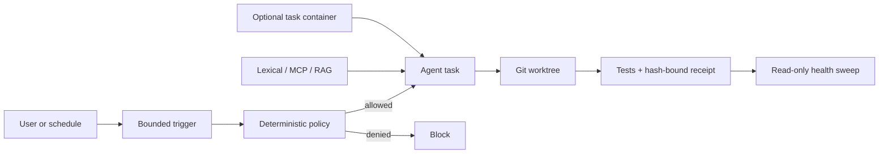

# Arnesto and Karajan Capability Current State

**Date:** 2026-09-23  
**Scope:** Deterministic policy, local retrieval/RAG, persistent maintenance agents, and container execution  
**Status:** Current-state research only; no capability was installed, enabled, or changed

## Summary

Arnesto currently has a portable instruction and validation core, bounded
multi-model execution, and a persistent Hermes ingress. It does not currently
have a general deterministic project-policy engine, a local RAG/MCP over the
Personal Knowledge Vault, autonomous maintenance agents, or a container
execution contract.

Karajan 4.31.1 contains implementations or integrations for all four areas, but
they are distinct subsystems rather than one mechanism:

- Sentinel policy enforcement is synchronous deterministic code, not an LLM
  running continuously.
- Steward is a bounded read-only sweep that runs on demand, on resume when
  stale, or from automation; it writes a versioned health report and proposes
  work.
- `karajan-rag` is a separate AGPL package with CLI, MCP, HTTP, hybrid retrieval,
  sensitivity routing, and PII redaction.
- Docker is used selectively for services and isolation, including Ollama and
  SonarQube; Karajan itself can also run in a container with documented limits.

## Arnesto current state

### Deterministic policy

Arnesto has partial policy-as-data rather than a general policy engine:

- `.agents/free-agent-routing.json` declares admitted free models, task classes,
  sensitivity, and execution budgets.
- `run-free-worker` validates the requested model and task class, limits timeout
  and input tokens, requires a Git worktree, serializes writers with a lock,
  checks changed-file scope, and executes the declared validation command.
- `.agents/rules/codex-default.rules` is a command allow-list for Codex rather
  than a project policy language.
- `templates/codex/hooks.json` configures Bash rewriting through RTK, not policy
  denial.
- The tracked `hooks/pre-commit` runs `make check`, but this checkout has no
  installed pre-commit hook and no `core.hooksPath` override.
- The proposed deterministic policy and hash-bound approval architecture is
  documented in
  `thoughts/shared/research/2026-09-22-karajan-policy-hashing-assessment.md`.
  It is not implemented.

### Code and knowledge retrieval

Arnesto has no repository-owned RAG, vector index, semantic search service, or
MCP server for local code or the Personal Knowledge Vault. Its shared MCP file
contains external service/documentation servers but no vault server.

The current retrieval model is progressive and file-native:

- agents use repository search, exact files, rules, skills, OpenSpec artifacts,
  and on-demand documentation;
- the Personal Knowledge Vault guide directs agents through maps, frontmatter,
  exact search, source provenance, and the smallest relevant files;
- the vault convention explicitly says to prefer exact search, summaries, maps,
  tags, and provenance before adding semantic/vector search;
- NotebookLM is used for digestion of long transcript sources, not as the live
  query layer or permanent source of truth.

Measured locally:

- Arnesto has 609 tracked files and approximately 3.3 MB across its primary
  text/code formats.
- The vault has 159 Markdown files, approximately 1.9 MB on disk and 1.19 MB of
  Markdown content.
- No MCP, embedding, vector, or query implementation files were found in the
  vault repository.

### Persistent processes and autonomous agents

Arnesto supports multiple agent runtimes and bounded delegation, but work starts
from a user or principal-agent action:

- Codex is the frontier planner/integrator.
- OpenCode can run one bounded, non-sensitive worker through OmniRoute.
- Hermes provides persistent Telegram ingress and model routing.
- Native Codex multi-agent support is enabled, but subagents are scoped to an
  active task; they are not repository maintenance daemons.

There are persistent local processes, but none is an autonomous maintenance
agent:

- `ai.hermes.gateway` is a running `launchd`-supervised messaging gateway.
- `ai.hermes.gateway-config-watch` is an event-triggered watcher that fingerprints
  selected Hermes configuration and restarts the gateway when semantic
  configuration changes.
- The watcher uses deterministic shell logic and SHA-256; it does not call an
  LLM or choose maintenance work.

During inspection, the `launchd` service description exposed an inherited
`OMNIROUTE_API_KEY` value. The value is intentionally not recorded here. No
credential or runtime configuration was changed. This demonstrates that local
process inspection can expose inherited secrets and that persistent-job designs
must minimize environment-secret propagation.

Arnesto does not currently contain a maintenance-task queue, scheduler, lease
model, autonomous repair loop, or repository-level Sentinel/Steward process.

### Containers

- Docker CLI 29.6.1 is installed.
- The Docker daemon was not running during inspection.
- No project Dockerfile, Compose file, or devcontainer was found in Arnesto.
- Current worker isolation is based on Git worktrees, tool permissions, file
  scope, process timeouts, and runtime-owned sandboxes rather than containers.

## Karajan current state

The inspected local audit checkout is `karajan-code` 4.31.1 at commit
`2a219fdde2566158d1024a13b6dd036e8dfb02e9`. The monorepo contains
`karajan-rag` 1.7.0 and `karajan-watch` 0.8.0. The packages are licensed under
AGPL-3.0 or AGPL-3.0-or-later.

### Policy and Sentinel

Karajan's governance engine evaluates a closed vocabulary in deterministic code.
The Sentinel wires project rules into synchronous tool and lifecycle hooks.
It can block protected-path changes, policy denials, identity violations,
cross-worktree writes, invalid claims, and red stop/push states before the
guarded action completes.

This is not an always-running agent. The LLM produces or judges work, while the
Sentinel evaluates observable state and actions.

The previously recorded focused governance audit found:

- 136 passing tests in one focused run;
- 74 passing and 2 failing Sentinel tests in another focused run, with failures
  caused by macOS `/var` versus `/private/var` path normalization;
- unsigned hash-named review receipts, which bind approval to a diff but do not
  cryptographically authenticate the reviewer.

### Steward

`kj steward sweep` is implemented as a bounded command. It evaluates declared
project-health invariants such as main CI freshness, security-audit freshness,
vulnerability age, dead-code trend, and coverage observability. It emits four
verdicts: `ok`, `broken`, `unknown`, and `not-observable`.

The command:

- writes `.karajan/steward/report.md` and `report.json` into the repository;
- uses the previous versioned report as shared baseline state;
- records the sweep in the hash-chained decision log;
- proposes work items for broken invariants;
- exits non-zero only for `broken` results;
- can skip a fresh report with `--if-stale`; and
- runs best-effort on session resume after the project has opted in.

The implementation and tests describe on-demand, on-resume, and action-based
execution. It is not a continuously reasoning LLM loop.

### RAG and MCP

`karajan-rag` 1.7.0 is a distinct context-engine package. Its easy interface
supports:

- indexing a code, documentation, or data directory into local LanceDB;
- hybrid vector plus BM25 retrieval with source and line information;
- RAG, full-corpus CAG, and file-level hybrid context modes;
- incremental reindexing and a local manifest;
- CLI queries, a two-tool MCP server (`rag_query`, `rag_status`), HTTP, and SDK;
- corpus and path sensitivity levels (`public`, `internal`, `confidential`);
- provider admission based on effective sensitivity; and
- PII redaction before guarded LLM generation.

Six focused tests files covering query, MCP, sensitivity enforcement,
sensitivity reindexing, policy/redaction, and redaction end-to-end were executed
from the audit checkout: 53 tests passed, 0 failed.

The package documentation also records a trust boundary: the guarded easy layer
applies policy and redaction, while lower-level APIs can require the integrator
to preserve those controls. The PII redactor documents a known homoglyph limit.

### Docker

Karajan uses Docker selectively:

- SonarQube and its database run in containers when enabled.
- The older integrated RAG path can provision Ollama in Docker.
- `karajan-rag` ships a Docker/Compose deployment option.
- Karajan CLI/MCP can run in a container without installing Node on the host.

The documented containerized Karajan CLI has constraints: agent CLIs remain on
the host or need external integration, Sonar cannot use unsupported
Docker-in-Docker, and interactive wizards may not work.

## Architecture notes

The four capabilities operate at different layers:

| Layer | Deterministic or cognitive | Persistent state |
|---|---|---|
| Policy/Sentinel | Deterministic | Policy, decisions, hook state |
| Retrieval/RAG | Deterministic retrieval plus optional LLM generation | Index, manifest, evaluation set |
| Maintenance task | Deterministic trigger plus optional agent reasoning | Run record, lease, report, proposed work |
| Container | Deterministic execution boundary | Image, cache, volumes, outputs |

## Open questions

1. Which concrete Personal Knowledge Vault questions currently fail exact
   search, maps, tags, and source provenance?
2. Should a vault query return passages only, or may it invoke an LLM to compose
   answers?
3. Which vault paths may each model/provider access, and must confidential paths
   remain local-only?
4. Which maintenance tasks are read-only detection, which may create proposed
   work, and which may modify code?
5. What maximum runtime, token budget, retry count, and frequency apply to each
   scheduled agent task?
6. Which tasks need stronger isolation than the current sandbox, worktree, and
   file-scope controls provide?
7. Is Karajan being considered as a full workflow owner or as an external
   component evaluated behind Arnesto adapters?

## References

- Prior Arnesto policy assessment:
  `thoughts/shared/research/2026-09-22-karajan-policy-hashing-assessment.md`
- Arnesto architecture: `docs/local-agentic-development-architecture.md`
- Arnesto routing design:
  `docs/openspec/changes/codex-led-agent-routing/design.md`
- Personal Knowledge Vault: `vault/AGENT_GUIDE.md`, `vault/README.md`, and
  `vault/_meta/conventions.md` in the sibling vault repository
- Karajan repository: <https://github.com/manufosela/karajan-code>
- Karajan Sentinel: <https://kj-code.com/docs/es/guides/sentinel/>
- Karajan RAG: <https://kj-code.com/docs/karagan/>
- Karajan external tools and Docker:
  <https://kj-code.com/docs/handbook/external-tools/>
- OpenAI long-horizon Codex guidance:
  <https://developers.openai.com/blog/run-long-horizon-tasks-with-codex>

